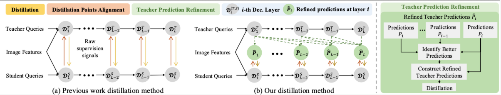
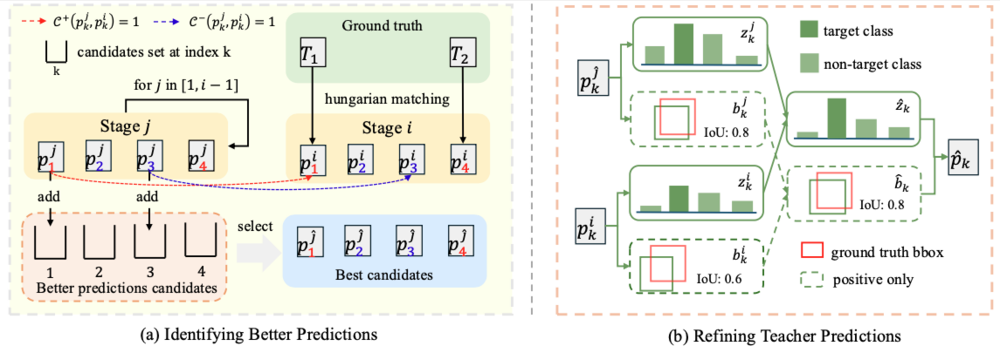

# <p align="center"> TPRD：Enhanced Knowledge Distillation for Detection Transformer via Teacher Prediction Refinement</p>
Yitong Xing, Yuhao Cheng, Yanping Li, Yichao Yan

<p align="center">
  
</p>
<p align="center">
  
</p>

## Project Overview

**Base framework**: [detrex](https://github.com/IDEA-Research/detrex)

### Supported DETR Variants
- Deformable DETR
- DAB-DETR
- DINO

### Supported Distillation Methods
- DETRDistill  
- D³ETR  
- KD-DETR  
- QSKD  
- CrossKD  
- Feature-based baselines (FGD, FitNet, MGD)

For each baseline distillation method, we provide a corresponding **TPRD-enhanced implementation**.

## Installation
We follow the official detrex installation procedure. Please refer to
[detrex](https://github.com/IDEA-Research/detrex) for detailed environment setup.

## Datasets
We conduct experiments on the following benchmarks:
* MS COCO 2017
* Pascal VOC

Please prepare datasets following the standard detrex / Detectron2 format.
Dataset paths should be organized according to the default detrex directory structure.
```text
datasets/
├── coco/
│   ├── annotations/
│   ├── train2017/
│   └── val2017/
├── VOC2007/
│   ├── Annotations/
│   ├── ImageSets/
│   └── JPEGImages/
├── VOC2012/
│   ├── Annotations/
│   ├── ImageSets/
│   └── JPEGImages/
└── VOC2007_test/
    ├── Annotations/
    ├── ImageSets/
    └── JPEGImages/
```

## Prepare Pretrained Weights
We use official detrex pretrained weights for teacher models:
* [Deformable DETR-R50](https://pan.baidu.com/s/1JuQyl4vKCMAoGhRjYO2SRw?pwd=e2na)
* [DINO-R50-4scale](https://github.com/IDEA-Research/detrex-storage/releases/download/v0.2.0/dino_r50_4scale_12ep_49_2AP.pth)
* [DAB-DETR-R50](https://github.com/IDEA-Research/detrex-storage/releases/download/v0.1.0/dab_detr_r50_50ep.pth)

For student models, the backbone is initialized with torchvision pretrained weights [resnet18](https://download.pytorch.org/models/resnet18-f37072fd.pth).

To initialize training, we merge the student backbone weights and teacher pretrained weights using the following script:
```python
python merge_weight.py \
    --input1 "path/to/student_backbnone weights"
    --input2 "path/to/teacher_pretrained weights"\
    --output "path/to/init_weight"
```
The generated weight file should be specified in the configuration as `train.init_weight`.

## Training
Example: Deformable DETR + DETRDistill + TPRD

You can run training using the provided script `train_distill.sh`.
For other distillation methods or DETR variants, please modify the configuration path accordingly.
```bash
CUDA_VISIBLE_DEVICES=0,1 python projects/deformable_detr/train_net.py \
    --config-file projects/deformable_detr/cfg_distill/DETRDistill_TPRD/deformable_detr_r50_distll_r18_50ep.py \
    --num-gpus 2 \
    train.output_dir="your output dir" \
    dataloader.train.total_batch_size=16
```

Baseline (without TPRD)
```bash
CUDA_VISIBLE_DEVICES=0,1 python projects/deformable_detr/train_net.py \
    --config-file projects/deformable_detr/cfg_distill/DETRDistill/deformable_detr_r50_distll_r18_50ep.py \
    --num-gpus 2 \
    train.output_dir="your output dir" \
    dataloader.train.total_batch_size=16
```

## Acknowledgement
This codebase is built upon [detrex](https://github.com/IDEA-Research/detrex) and incorporates implementations from prior distillation works, including [KD-DETR](https://github.com/wennyuhey/KD-DETR), [DETRDistill](https://github.com/BIVLab-USTC/DETRDistill), [FGD](https://github.com/yzd-v/FGD), [MGD](https://github.com/yzd-v/MGD), [CrossKD](https://github.com/jbwang1997/CrossKD). We sincerely thank the authors and contributors for making their work publicly available.


